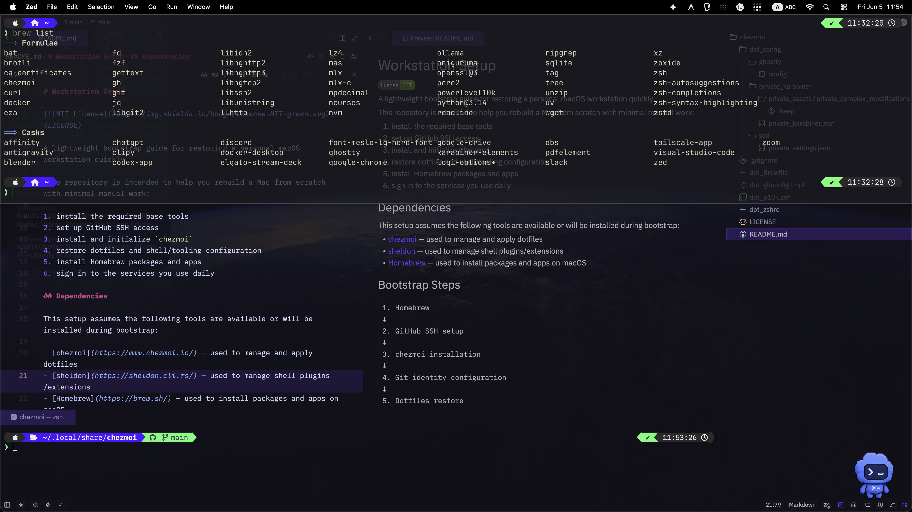

# Workstation Setup

[](LICENSE)

---



---

## Overview

This repository provides a lightweight bootstrap flow for restoring a personal macOS workstation with minimal manual work.

It covers the initial setup from Homebrew installation and GitHub SSH access to dotfile restoration, Homebrew bundle installation, and daily service login.

## Table of Contents

- [Dependencies](#dependencies)
- [Bootstrap Steps](#bootstrap-steps)
- [1. Install Homebrew](#1-install-homebrew)
- [2. Set Up GitHub SSH Access](#2-set-up-github-ssh-access)
- [3. Install chezmoi](#3-install-chezmoi)
- [4. Initialize Dotfiles](#4-initialize-dotfiles)
- [5. Apply the Brewfile](#5-apply-the-brewfile)
- [6. Sign in to Services](#6-sign-in-to-services)
- [Optional Quality Checks](#optional-quality-checks)

## Dependencies

This setup assumes the following tools are available or will be installed during bootstrap:

- [chezmoi](https://www.chezmoi.io/) — used to manage and apply dotfiles
- [sheldon](https://sheldon.cli.rs/) — used to manage shell plugins/extensions
- [Homebrew](https://brew.sh/) — used to install packages and apps on macOS and Linux

## Bootstrap Steps

```text
1. Homebrew
↓
2. GitHub SSH setup
↓
3. chezmoi installation
↓
4. Git identity configuration
↓
5. Dotfiles restore
↓
6. Brewfile execution
↓
7. Service logins
```

---

## 1. Install Homebrew

Follow the official installation guide for your operating system:

- [Install Homebrew on macOS](https://docs.brew.sh/Installation.html)
- [Install Homebrew on Linux or WSL](https://docs.brew.sh/Homebrew-on-Linux)

After installation, follow the post-install instructions shown by Homebrew to add it to your shell environment.

### Verify

```bash
brew --version
```

---

## 2. Set Up GitHub SSH Access

### Create the SSH directory

```bash
mkdir -p ~/.ssh
chmod 700 ~/.ssh
```

### Generate an SSH key

```bash
ssh-keygen -t ed25519 -C "your_email@example.com" \
  -f ~/.ssh/github_ed25519
```

### Generated files

```text
~/.ssh/github_ed25519
~/.ssh/github_ed25519.pub
```

### Configure SSH

```bash
cat <<EOF > ~/.ssh/config
Host github.com
    HostName github.com
    User git
    IdentityFile ~/.ssh/github_ed25519
    IdentitiesOnly yes
EOF
```

### Fix permissions

```bash
chmod 600 ~/.ssh/config
```

### Show the public key

```bash
cat ~/.ssh/github_ed25519.pub
```

Add the key in GitHub:

**Settings → SSH and GPG keys → New SSH key**

### Verify the connection

```bash
ssh -T git@github.com
```

---

## 3. Install chezmoi

```bash
brew install chezmoi
```

---

## 4. Initialize Dotfiles

```bash
chezmoi init git@github.com:<username>/<dotfiles-repository>.git
```

### First apply

```bash
chezmoi apply
```

### Enter Git identity on first setup only

```text
Git User Name:
Git Email:
```

The values are stored in chezmoi's local configuration and can be reused the next time you rebuild the machine.

### Verify Git configuration

```bash
git config --global --list
```

---

## 5. Apply the Brewfile

```bash
brew bundle --file ~/.Brewfile
```

---

## 6. Sign in to Services

Recommended login order:

1. Google Chrome
2. Tailscale
3. Google Drive
4. Slack
5. Discord
6. Zoom
7. Docker Desktop
8. GitHub CLI Auth

```bash
gh auth login
```

---

## Optional Quality Checks

This repository includes optional cross-platform tests, shell linting, formatting checks, and a local pre-commit hook.

They are useful when actively maintaining the dotfiles, but they are not required for using the workstation setup. See [Tests and Git Hooks](docs/testing-and-hooks.md) for setup, commands, maintenance notes, and instructions for disabling or removing them.

---

## Done

Your macOS environment should now be restored.
